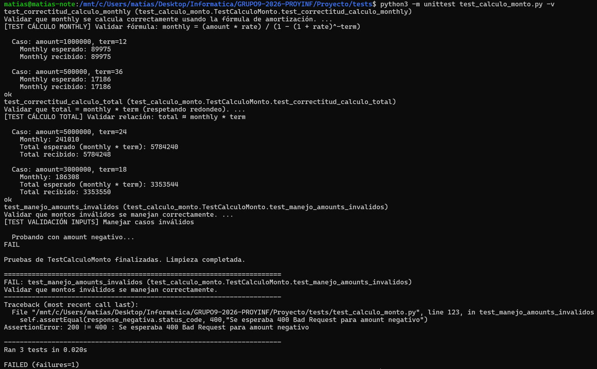
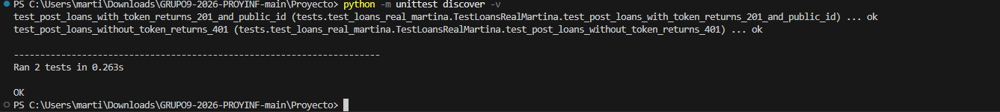
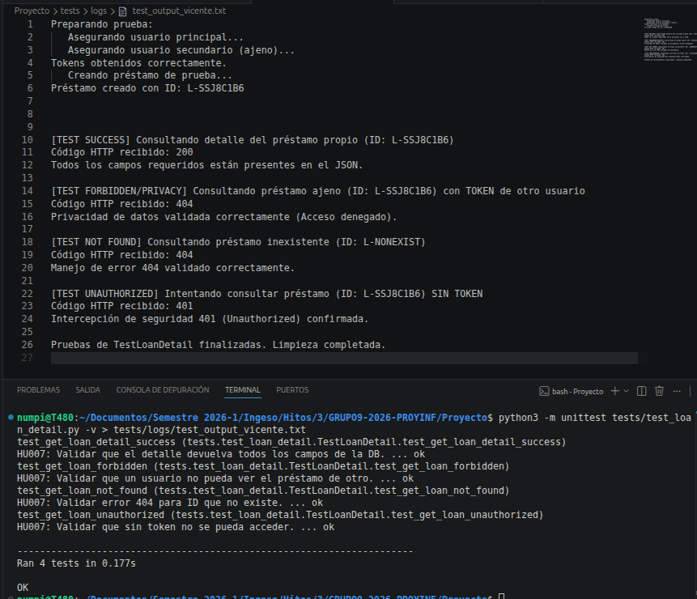

## Ejecución

### Ejecución general de todos los tests

`python3 -m unittest discover -v`

## Pruebas

### Matías: Correctitud en cálculo de monto y total (HU001)

Prueba: `POST /api/loans/`

|Input | Output esperado |
|-----|---------|
|amount: 1000000, term: 12| 89975 | 
|amount: 500000, term: 36| 17186 | 
|amount: 5000000, term: 24| 5784240 | 
|amount: 3000000, term: 18| 3353544 | 
|amount: -1000000, term: 12| Error | 
|amount: 1000000, term: 0| 1012000 | 

 

**Estrategia y Justificación:**

La estrategia es validar que los valores calculados por los métodos de la aplicación, y consultados mediante la API, sean coherentes a los inputs con que se realizan las consultas. Para ello, se calcula localmente (en el archivo de los tests) el monto esperado y luego se consulta a la API con los mismos inputs, esperando que sean iguales. Se realiza prueba con casos frontera de valores negativos y cero para analizar el manejo que la API realiza con estos valores. Siempre usando clases de equivalencia.

**Ejecución específica de la prueba de Detalle**
  
`python3 -m unittest test_calculo_monto.py -v`

Para guardar log de la ejecucion del test en txt, desde carpeta tests/:
`python3 -m unittest test_calculo_monto.py -v > logs/test_output_matias.txt`

**Evidencia de Ejecución**

**Análisis de Resultados:**

Para las pruebas "test_correctitud_calculo_monthly" y "test_correctitud_calculo_total", los resultados fueron coherentes con lo esperado, lo cual indica que las cuotas y total de la simulación de préstamo son calculados correctamente y que la API también los entrega correctamente.
Para "test_manejo_amounts_invalidos", hubo una prueba fallida a la hora de intentar un amount negativo, pues se esperaba que la aplicación arrojara un error dado que no es posible calcular cuotas a partir de montos negativos, pero en su lugar los calculó de igual manera, lo cual es un comportamiento que se debe corregir. Para el caso en que term=0, la prueba fue exitosa pues se maneja correctamente y se retorna un valor coherente para cuando queremos pedir un préstamo con plazo=0.

1. **Prueba con valores normales**: 
   - `test_correctitud_calculo_monthly`: Validamos si la cuota monthly es calculada y retornada correctamente por la API.
   - `test_correctitud_calculo_total`: Validamos si el total es calculado y retornado correctamente por la API.
2. **Pruebas con valores negativo y cero**:
   - `test_manejo_amounts_invalidos`: Validamos si el cálculo de monthly y total es correcto y coherente si es que tenemos un input negativo y cero, respectivamente.

### Martina: envío real de solicitud de préstamo con autorización

| Input | Output esperado |
|---|---|
| `GET /api/health` | `200 OK` | 
| `POST /api/auth/register` con usuario de prueba válido | `201 Created` |
| `POST /api/auth/login` con email y password válidos | `200 OK` y token JWT |
| `POST /api/loans` con `amount=500000`, `term=12`, sin `dryRun` y con header `Authorization: Bearer <token>` | `201 Created` e `id` con formato `L-...` | 
| `GET /api/loans/:id` con token válido | `200 OK` y `loan_id_str` igual al ID creado | 
| `POST /api/loans` con `amount=500000`, `term=12`, sin `dryRun` y sin token | `401 Unauthorized` |

**Estrategia de prueba**

Se usó partición por clases de equivalencia para comparar dos casos principales: una solicitud real autenticada con token válido y una solicitud real no autenticada sin token. Como valor frontera de autorización se considera el paso de no enviar credenciales a enviar un token válido, verificando que sin token el sistema responda `401 Unauthorized` y con token permita crear el préstamo con `201 Created`.

**Endpoints seleccionados**

- `GET /api/health`
- `POST /api/auth/register`
- `POST /api/auth/login`
- `POST /api/loans`
- `GET /api/loans/:id`

**Evidencia de ejecución**

**Ejecución específica de la prueba**
`python3 -m unittest test_loans_real_martina.py -v`

### Alejandro: Historial de prestamos (HU007)
Prueba a Prueba: GET /api/loans/

|Input | Output esperado |
|-----|---------|
|Inicio de sesion con credenciales validas| 200 OK| 
|Credenciales con un prestamo y sin prestamos|Lista de campos del prestamo hecho y una lista vacia|

Tiempo empleado de 7hrs aproximado.
Las pruebas fueron exitosas, ambas pruebas retornaron lo esperado, codigo 200 para obtener el historial y las listas de los  

**Ejecución específica de la prueba**
`python3 -m unittest test_historial.py -v`

### Vicente: Detalle de Préstamo (HU007)

Prueba: `GET /api/loans/:id`

|Input | Output esperado |
|-----|---------|
|id válido + Token propio| 200 OK + JSON completo | 
|id inexistente|404 Not Found|
|id válido + Token ajeno|404/403 Error|
|Sin Token de acceso|401 Unauthorized|

 

**Estrategia y Justificación:**

La estrategia se basa en clases de equivalencia para validar tanto el flujo de éxito (ID propio) como el manejo de errores (ID inexistente). Se aplica un enfoque de seguridad en valores frontera al testear el acceso con tokens de terceros o nulos, asegurando que el backend filtre correctamente por user_rut y no solo por loan_id_str. Esto garantiza que la información sensible del préstamo solo sea accesible por su propietario legítimo, cumpliendo con los estándares de integridad de la HU007.

**Ejecución específica de la prueba de Detalle**
  
`python3 -m unittest tests/test_loan_detail.py -v`

para guardar log de la ejecucion del test en txt
`python3 -m unittest tests/test_loan_detail.py -v > tests/logs/test_output_vicente.txt`

**Evidencia de Ejecución**

**Análisis de Resultados:**

Al ejecutar las pruebas, se obtienen 4 éxitos. El objetivo de esta prueba fue (1) asegurarnos que bajo condiciones ideales la consulta de datos de prestamos sea correcta y (2) provocar errores intencionalmente para verificar que las protecciones del sistema actúan correctamente frente a casos erróneos o maliciosos:

1. **Prueba de condición ideal**: 
   - `test_get_loan_detail_success`: Validamos que bajo condiciones ideales (ID propio válido con token), el sistema nos devuelve el código 200 OK y todos los datos del préstamo correspondiente.
2. **Pruebas Negativas y Validaciones**:
   - `test_get_loan_not_found`: Validamos que si consultamos una ID que no existe, el servidor no colapsa internamente, sino que responde de manera controlada con 404 Not Found.
   - `test_get_loan_unauthorized`: Validamos la eficacia del middleware de autenticación. Al omitir el token, la API intercepta la petición y bloquea el acceso en la puerta devolviendo 401 Unauthorized.
   - `test_get_loan_forbidden`: Validamos la privacidad de los datos al nivel de base de datos. Al intentar acceder a un préstamo aportando su ID exacto pero usando un Token ajeno, el servidor nos bloquea de manera segura (con 404 Not Found o 403 Forbidden), impidiendo que robemos información sensible.

**Sobre la Limpieza (tearDownClass):**
En la clase de prueba se implementó el método `tearDownClass()`, cuya responsabilidad teórica es conectarse a la Base de Datos para eliminar todos los datos falsos generados durante la etapa previa (`setUpClass`). Sin embargo, su implementación actual se limita a un print(), debido a que para el estado actual de nuestro MVP, el backend no expone explícitamente un endpoint o lógica para eliminar préstamos (como un `DELETE /api/loans/:id`). Por ello, se simula formalmente la fase para cumplir con el estándar de unittest sin modificar artificialmente o ensuciar las rutas de producción.

