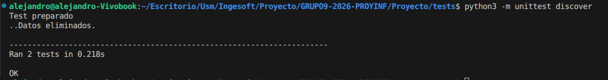

### Alejandro: Historial de prestamos (HU007)
Prueba a Prueba: GET /api/loans/

|Input | Output esperado |Contexto de ejecución|
|-----|---------|-------|
|Obtener el historial de prestamos| 200 OK| Comprobar si el GET retorna el historial en dos usuarios|
|Obtener los campos de un prestamo en el historial|Lista de campos del prestamo hecho y una lista vacia|Comprobar que retorna los datos de prestamo con o sin historial

Tiempo empleado de 7hrs aproximado.
Las pruebas fueron exitosas, ambas pruebas retornaron lo esperado, codigo 200 para obtener el historial y las listas de los  